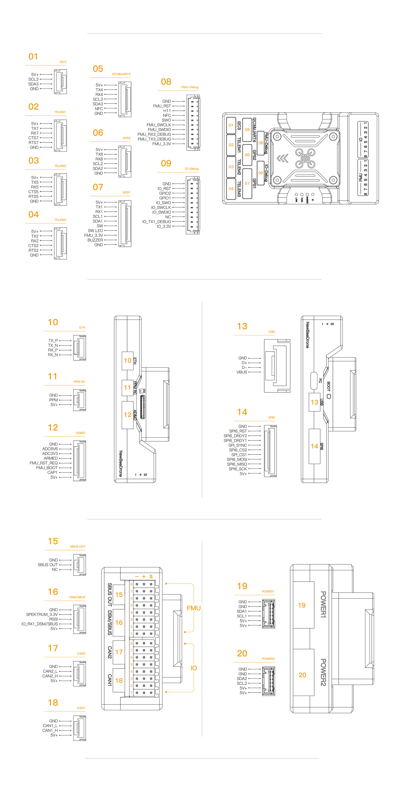

# NewBeeDrone PixNova Flight Controller

The NewBeeDrone PixNova flight controller is produced by NewBeeDrone. It is
based on the Pixhawk FMUv6X, Pixhawk Autopilot Bus, and Pixhawk Connector open
standards. This target supports the production PixNova Rev B hardware.


## Pinout



## Dimensions


## Features

- STM32H753IIK6 microcontroller running at 480 MHz
- STM32F100 IOMCU
- three ICM45686 IMUs on independent SPI buses
- builtin IST8310 magnetometer
- BMP388 and ICP-20100 barometers
- temperature-controlled IMU heater
- 32 KB SPI FRAM parameter storage
- microSD card slot
- USB Type-C
- seven hardware UARTs plus USB
- 16 PWM outputs
- three external I2C buses
- two independent CAN buses
- Ethernet
- external SPI bus with two chip selects
- two digital power monitor ports

## UART Mapping

The UART mapping is:

| Serial | Port | UART |
| --- | --- | --- |
| SERIAL0 | USB | OTG1 |
| SERIAL1 | TELEM1 | UART7 |
| SERIAL2 | TELEM2 | UART5 |
| SERIAL3 | GPS1 | USART1 |
| SERIAL4 | GPS2 | UART8 |
| SERIAL5 | TELEM3 | USART2 |
| SERIAL6 | UART4/EXT2 | UART4 |
| SERIAL7 | FMU DEBUG | USART3 |
| SERIAL8 | second USB virtual serial port | OTG2 |

The TELEM1, TELEM2, and TELEM3 ports have RTS/CTS pins. The other hardware
UARTs do not have RTS/CTS. All hardware UARTs are DMA capable.

USART6 is reserved for the IOMCU and is not available as a general-purpose
serial port. The USART3 connector is labelled FMU DEBUG, but it can be used as
a general-purpose UART with ArduPilot.

## RC Input

The dedicated RC input can be used for all ArduPilot-supported unidirectional
receiver protocols. Half-duplex and bidirectional protocols such as CRSF/ELRS,
FPort, and SRXL2 require a full UART. SERIAL6 or another available hardware
UART can be used for these protocols. See the
[RC systems documentation](https://ardupilot.org/copter/docs/common-rc-systems.html)
for protocol-specific settings.

## PWM Output

The PixNova supports up to 16 PWM outputs. The first eight outputs, labelled
MAIN1 to MAIN8, are controlled by the STM32F100 IOMCU. The remaining eight
outputs, labelled AUX1 to AUX8, are directly attached to the STM32H753 FMU.

The eight MAIN outputs are in three groups:

- MAIN1 and MAIN2 in group 1 (TIM2)
- MAIN3 and MAIN4 in group 2 (TIM4)
- MAIN5, MAIN6, MAIN7, and MAIN8 in group 3 (TIM3)

The eight AUX outputs are in three groups:

- AUX1, AUX2, AUX3, and AUX4 in group 1 (TIM5)
- AUX5 and AUX6 in group 2 (TIM4)
- AUX7 and AUX8 in group 3 (TIM12)

Outputs within the same group must use the same output rate and protocol. If
any output in a group uses DShot, all outputs in that group must use DShot.

AUX1 through AUX6 support PWM and DShot. Bidirectional DShot is available on
AUX1, AUX3, AUX5, and AUX6. AUX7 and AUX8 support PWM only. The normal and
DShot-capable IOMCU firmware images are embedded in the ArduPilot firmware.
Set `BRD_IO_DSHOT` to `1` and reboot before configuring a MAIN output for
DShot.

## Battery Monitoring

The PixNova has two digital power monitor ports. The default parameters for an
INA2xx power monitor connected to the Power1 port are:

```text
BATT_MONITOR 21
BATT_I2C_BUS 1
BATT_I2C_ADDR 0
```

For a second INA2xx power monitor connected to the Power2 port, use:

```text
BATT2_MONITOR 21
BATT2_I2C_BUS 2
BATT2_I2C_ADDR 0
```

The IOV2 baseboard uses a 100 kOhm/10 kOhm divider for servo rail voltage
sensing. ArduPilot applies the corresponding 11:1 scale to the IOMCU servo
rail voltage telemetry.

## Compass

The PixNova has a builtin IST8310 compass. Due to potential interference, an
external compass mounted away from power wiring is normally recommended. The
GPS1/I2C port supports an external IST8310 compass.

## GPIOs

The PWM outputs can be used as GPIOs after setting the corresponding
`SERVOx_FUNCTION` parameter to `-1`. See the
[GPIO documentation](https://ardupilot.org/copter/docs/common-gpios.html) for
more information.

The GPIO numbers used by ArduPilot pin parameters are:

- AUX1 through AUX8: 50 through 57
- FMU_CAP1: 58
- NFC_GPIO: 60
- SPI6 device 1 DRDY: 93
- SPI6 device 2 DRDY: 94
- MAIN1 through MAIN8: 101 through 108

## Analog Inputs

The PixNova has two analog inputs:

- ADC pin 12: 6.6 V sense
- ADC pin 13: 3.3 V sense

## CAN

The PixNova has two independent CAN buses. Both CAN ports are enabled by
default.

## Ethernet

Ethernet is enabled by default using DHCP. Network port 1 is configured as a
MAVLink 2 UDP server on port 14550.

## External SPI

The external SPI6 port provides two chip selects and two data-ready inputs.
PF10 is the active-low reset signal and PE9 is the external sensor
synchronisation output.

## Loading Firmware

The board comes with a bootloader that allows loading
`NewBeeDrone_pixnova` `.apj` firmware files with an ArduPilot-compatible
ground station.

PixNova uses board ID 5900, an application start address of `0x08020000`, and
a 1920 KiB application area. These values match the corresponding PX4 target
and allow switching between PX4 and ArduPilot application firmware. Replacing
the bootloader itself is a separate operation and requires the correct
PixNova bootloader image.

## Further Information

- [PX4 NewBeeDrone PixNova board-support PR](https://github.com/PX4/PX4-Autopilot/pull/26966)
- [Pixhawk FMUv6X Standard](https://github.com/pixhawk/Pixhawk-Standards/blob/master/DS-012%20Pixhawk%20Autopilot%20v6X%20Standard.pdf)
- [Pixhawk Autopilot Bus Standard](https://github.com/pixhawk/Pixhawk-Standards/blob/master/DS-010%20Pixhawk%20Autopilot%20Bus%20Standard.pdf)
- [Pixhawk Connector Standard](https://github.com/pixhawk/Pixhawk-Standards/blob/master/DS-009%20Pixhawk%20Connector%20Standard.pdf)
